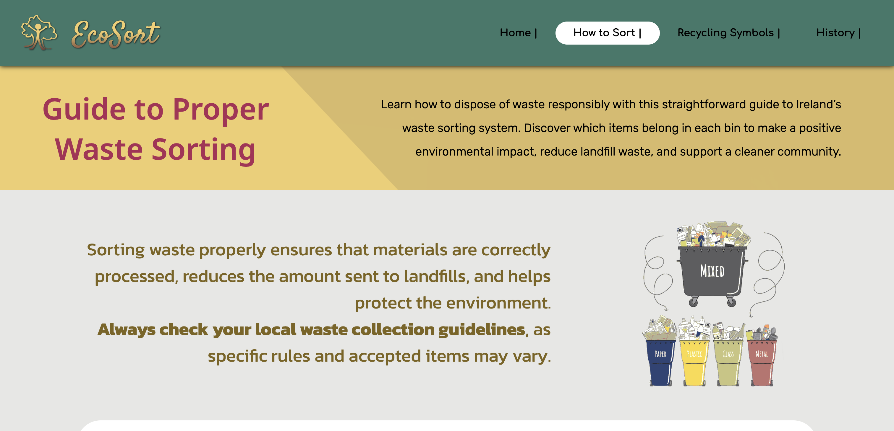
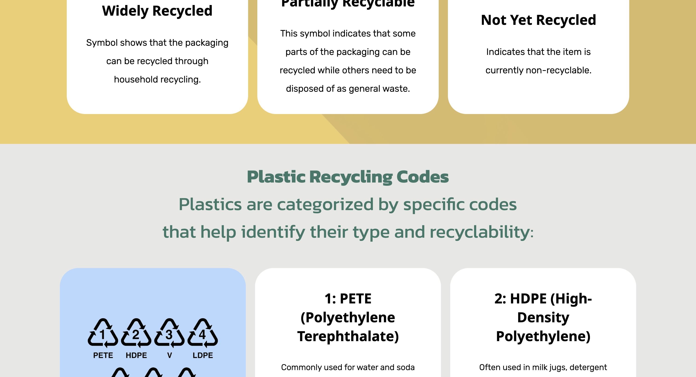
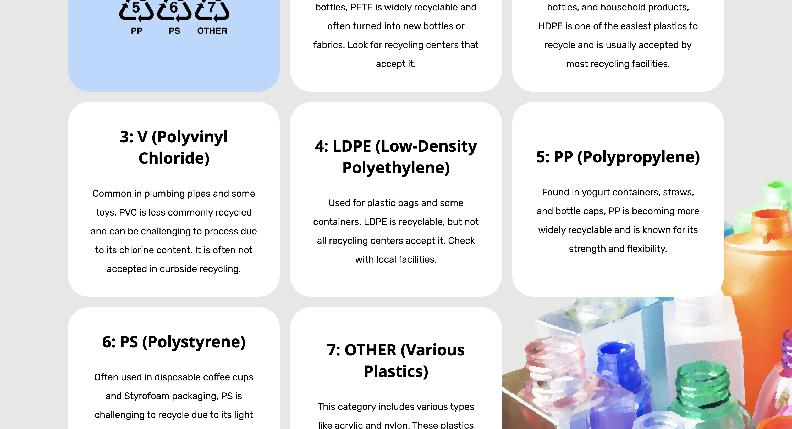
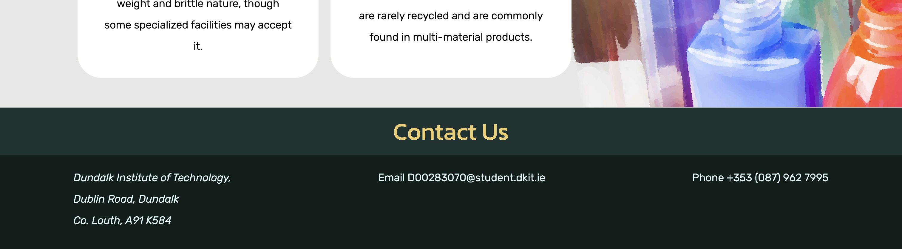

# Responsive Website Project

This repository contains a responsive and professionally designed website created as part of an assignment. The project demonstrates the use of custom HTML, CSS, and advanced image manipulation techniques. The website is fully responsive and includes features such as an image gallery and a responsive navigation menu.

## Features

### 1. HTML Structure
- Four professionally written HTML pages:
  - `index.html` (Homepage)
  - `how_to_sort.html`
  - `recycling_symbols.html` (Image Gallery)
  - `recycling_history.html`
- Code written without templates or copied code, ensuring originality.

### 2. CSS Styling
- Custom CSS for a professional look-and-feel.
- Fully responsive design for optimal viewing on mobile and desktop devices.
- Responsive navigation menu.

### 3. Image Manipulation
- Includes:
  - One image manipulated using external tools (Krita).
  - One image manipulated using **CSS masks**.
  - One image manipulated using **CSS blending**.
  - One image manipulated using **CSS filters**.
 
## Screenshots

### Header Example


### Website Section




## How to View the Project
1. Clone the repository:
   ```bash
   git clone https://github.com/smiichyk/EcoSort
   ```
2. Open `index.html` in a browser to view the website locally.

Alternatively, visit the live version hosted on GitHub Pages: 
[Live Website](https://github.com/smiichyk/EcoSort)

## License
This project is licensed under the [MIT License](LICENSE).
